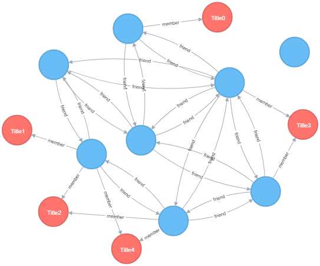

# DB_Lab3
## Usage of Neo4j (social network db)

**GRAPH NODES:**
 - Blue - Users
 - Red - Groups

**Database** consists of 7 Users and 5 Groups. Total: 13 Nodes and 30 relationships.

### MATCH queries
**Для пользователей**
- Упорядоченный список логинов  
+----------+  
Login  
+----------+  
| "login0" |  
| "login1" |  
| "login2" |  
| "login3" |  
| "login4" |  
| "login5" |  
| "login6" |  
| "login7" |  
+----------+
- Список логинов мужчин с указанием возраста, упорядоченный по убыванию  
+----------------+  
Age | Login   
+----------------+  
| 52  | "login1" |  
| 27  | "login0" |  
+----------------+  
- Упорядоченный список логинов друзей login6  
+----------+  
Login  
+----------+  
| "login1" |  
| "login2" |  
| "login7" |  
+----------+  
- Упорядоченный список логинов друзей друзей  
+----------+  
Login  
+----------+  
| "login1" |  
| "login2" |  
| "login3" |  
| "login4" |  
| "login5" |  
| "login6" |  
+----------+  
- Упорядоченный по алфавиту список логинов с указанием количества друзей  
+-------------------------+  
Login    | FriendsCount  
+-------------------------+  
| "login0" | 0            |  
| "login1" | 3            |  
| "login2" | 5            |  
| "login3" | 4            |  
| "login4" | 2            |  
| "login5" | 3            |  
| "login6" | 3            |  
| "login7" | 2            |  
+-------------------------+  

**Для групп**
- Упорядоченный список групп  
+----------+  
Title  
+----------+  
| "Title0" |  
| "Title1" |  
| "Title2" |  
| "Title3" |  
| "Title4" |  
+----------+
- Упорядоченный список групп login6  
+----------+  
Title  
+----------+  
| "Title2" |  
| "Title4" |  
+----------+  
- Список групп с указанием количества членов, упорядоченный по убыванию количества  
+-----------------------------+  
Title    | SubscribersCount  
+-----------------------------+  
| "Title4" | 2                |  
| "Title3" | 2                |  
| "Title2" | 2                |  
| "Title1" | 1                |  
| "Title0" | 1                |  
+-----------------------------+  
- Список логинов пользователей с указанием количества групп, в которые они входит, упорядоченный по убыванию  
+------------------------+  
Login    | GroupsCount  
+------------------------+  
| "login7" | 3           |  
| "login6" | 2           |  
| "login2" | 1           |  
| "login1" | 1           |  
| "login4" | 1           |  
| "login5" | 0           |  
| "login0" | 0           |  
| "login3" | 0           |  
+------------------------+  
- Общее количество групп, в которых состоят друзья друзей login6  
+---------------------------+  
FriendsOfFriendsGroupsCount  
+---------------------------+  
| 9                         |  
+---------------------------+  

**Для статусов**
- Список статусов login6  
+----------------------------------+  
Statuses  
+----------------------------------+  
| ["mukayrotfbbdexxpwxcijgywlmnj"] |  
+----------------------------------+  
- Список средних длин статусов пользователя, отсортированный по убыванию средней длины  
+----------------------------------+  
Login    | AverageStatusesLength  
+----------------------------------+  
| "login6" | 28.0                  |  
| "login7" | 22.0                  |  
| "login1" | 22.0                  |  
| "login4" | 18.0                  |  
| "login3" | 18.0                  |  
| "login2" | 17.0                  |  
| "login0" | 17.0                  |  
| "login5" | 10.0                  |  
+----------------------------------+
- Все записи в социальной сети, длиннее 8 символов  
+----------------------------------------------------------------------------------------------------+  
Statuses  
+----------------------------------------------------------------------------------------------------+  
| ["ajkhhkakuyqkllh","bblubptdnude","ugskejdbtqkeyfjfivjoqlkgih"]                                    |  
| ["fueykdcumldkblranqcfyb","mmghdycglgcgijmbmxichs"]                                                |  
| ["mukayrotfbbdexxpwxcijgywlmnj"]                                                                   |  
| ["uiselogblcxqyurrvdohmm","buptsrvdiyxgwoe"]                                                       |  
| ["mprtcdtpluqpykfbhnutjuunjvwhco","nilfyqdynbthy"]                                                 |  
| ["ndpsktwdvavvumgmaelekhplx","tchxreejqtvoljhpgxxdpeouida"]                                        |  
| ["hurbxidemdmuifcphl","vdmvggpimlkxgplklnwu","wcrhgirynhitpkgnpbvnrpmthpeabp","pvgbodsfvepicesmh"] |  
| ["fnaaasqnehcpasqqtndcuvw","yhdwluwcjs"]                                                           |  
+----------------------------------------------------------------------------------------------------+  
- Список логинов с указанием количества статусов, упорядоченнный по убыванию количества  
+--------------------------+  
Login    | StatusesCount  
+--------------------------+  
| "login4" | 5             |  
| "login0" | 4             |  
| "login5" | 4             |  
| "login3" | 3             |  
| "login1" | 2             |  
| "login2" | 2             |  
| "login7" | 2             |  
| "login6" | 1             |  
+--------------------------+  
- Все записи друзей друзей login6  
+-----------------------------------------------------------------------------------------------------------+  
Statuses  
+-----------------------------------------------------------------------------------------------------------+  
| ["ajkhhkakuyqkllh","bblubptdnude","ugskejdbtqkeyfjfivjoqlkgih"]                                           |  
| ["fnaaasqnehcpasqqtndcuvw","yhdwluwcjs"]                                                                  |  
| ["hurbxidemdmuifcphl","vdmvggpimlkxgplklnwu","fykk","wcrhgirynhitpkgnpbvnrpmthpeabp","pvgbodsfvepicesmh"] |  
| ["mprtcdtpluqpykfbhnutjuunjvwhco","nilfyqdynbthy"]                                                        |  
| ["mukayrotfbbdexxpwxcijgywlmnj"]                                                                          |  
| ["uiselogblcxqyurrvdohmm","mn","buptsrvdiyxgwoe","t"]                                                     |  
+-----------------------------------------------------------------------------------------------------------+  

